# 💳 TenRusl Payment Webhook Simulator

[](https://github.com/kakrusliandika/tenrusl-payment-webhook-sim/actions)


Demo **Laravel 12** untuk memamerkan arsitektur payment yang rapi: **idempotency**, **dedup webhook**, **signature verification**, dan **exponential backoff retry (simulasi)**—tanpa kredensial gateway asli. Cocok untuk portfolio & pembelajaran praktik produksi.

---

## 🧭 Daftar Isi

- [Fitur](#-fitur)
- [Arsitektur Singkat](#-arsitektur-singkat)
- [Quick Start](#-quick-start)
- [Konfigurasi Lingkungan](#-konfigurasi-lingkungan)
- [Endpoint API](#-endpoint-api)
- [Webhook Signature (Simulasi)](#-webhook-signature-simulasi)
- [Swagger & Postman](#-swagger--postman)
- [Testing & CI](#-testing--ci)
- [Struktur Direktori](#-struktur-direktori)
- [Troubleshooting](#-troubleshooting)
- [Lisensi](#-lisensi)

---

## ✨ Fitur

- 🔐 **Idempotency** untuk `POST /payments` via header `Idempotency-Key`
- 🧬 **Dedup Webhook** berdasarkan `provider + event_id`
- 🔏 **Signature Verification**:
  - **Mock** (HMAC-SHA256 raw body + `MOCK_SECRET`)
  - **Xendit** (`x-callback-token`)
  - **Midtrans** (`Signature-Key` hadir / siap dihitung)
- 🔁 **Exponential Backoff Retry** (1/2/4/8/16s) untuk event gagal (simulasi)
- 📜 **OpenAPI (Swagger UI)**, 🗂️ **Postman collection**
- 🧪 **Pest tests**, ✅ **GitHub Actions CI**
- 🐳 **Docker dev** (opsional)

---

## 🧱 Arsitektur Singkat

```mermaid
flowchart TD
  A[Client] -->|Idempotency-Key| B[POST /api/v1/payments]
  B -->|create pending| P[(payments)]
  W[Provider] -->|POST /api/v1/webhooks/&#123;provider&#125;| C[WebhooksController]
  C -->|Verify Signature| S[SignatureVerifier]
  C -->|Dedup + Orkestrasi| R[WebhookProcessor]
  R -->|Update Status| P
  R -->|Retry Fail| Q[(webhook_events)]
```



- **PaymentsService**: create/payment status + idempotency snapshot
- **SignatureVerifier**: verifikasi per provider
- **WebhookProcessor**: dedup event → update status payment → retry bila gagal
- **RetryBackoff**: hitung jeda retry eksponensial

---

## 🚀 Quick Start

**Prasyarat**: PHP 8.3+, Composer, SQLite (dev), Git

1. Instal dependensi & salin env
   - `composer install`
   - salin `.env.example` → `.env`, set `APP_KEY` via `php artisan key:generate`
2. DB SQLite (dev cepat)
   - buat `database/database.sqlite`
   - set `.env`: `DB_CONNECTION=sqlite`
3. Migrasi & jalankan
   - `php artisan migrate`
   - `php artisan serve` → `http://127.0.0.1:8000`
4. Swagger UI: `http://127.0.0.1:8000/api/documentation`

> **Tip**: untuk replay idempotency, panggil `POST /payments` dengan **header** `Idempotency-Key` yang sama.

---

## 🔧 Konfigurasi Lingkungan

Tambahkan ke `.env` (contoh minimal):

| Kunci                   | Contoh                        | Keterangan                                 |
| ----------------------- | ----------------------------- | ------------------------------------------ |
| `APP_NAME`              | `TenRusl Payment Webhook Sim` | Nama aplikasi                              |
| `DB_CONNECTION`         | `sqlite`                      | Dev cepat                                  |
| `MOCK_SECRET`           | `changeme`                    | HMAC untuk provider `mock`                 |
| `XENDIT_CALLBACK_TOKEN` | `changeme`                    | Token callback Xendit                      |
| `MIDTRANS_SERVER_KEY`   | `changeme`                    | Untuk perhitungan signature-key (opsional) |

> Konfigurasi ini dipetakan di `config/tenrusl.php`.

---

## 📡 Endpoint API

Base URL: `http://127.0.0.1:8000/api/v1`

| Method & Path               | Deskripsi                   | Header Penting            | Body                                             |
| --------------------------- | --------------------------- | ------------------------- | ------------------------------------------------ | -------------------- | ------------------------------------ |
| `POST /payments`            | Buat payment (idempotent)   | `Idempotency-Key: <uuid>` | `{ amount, currency?, description?, metadata? }` |
| `GET /payments/{id}`        | Lihat status payment        | –                         | –                                                |
| `POST /webhooks/{provider}` | Terima event webhook (`mock | xendit                    | midtrans`)                                       | Lihat tabel di bawah | `{ event_id, type, data, sent_at? }` |

---

## 🔏 Webhook Signature (Simulasi)

| Provider   | Header             | Cara Hitung / Verifikasi                                                                             |
| ---------- | ------------------ | ---------------------------------------------------------------------------------------------------- |
| `mock`     | `X-Mock-Signature` | `HMAC-SHA256(raw_body, MOCK_SECRET)` dalam **hex lowercase**                                         |
| `xendit`   | `x-callback-token` | token **harus sama** dengan `XENDIT_CALLBACK_TOKEN`                                                  |
| `midtrans` | `Signature-Key`    | minimal hadir. Opsi realistis: `sha512(order_id + status_code + gross_amount + MIDTRANS_SERVER_KEY)` |

> **Postman collection** sudah menyiapkan pre-request scripts untuk menghitung header secara otomatis.

---

## 📜 Swagger & 📨 Postman

- **Swagger UI**: `http://127.0.0.1:8000/api/documentation`
  (Output file otomatis di `storage/api-docs/openapi.yaml|json`)

- **Postman**: impor berkas berikut:
  - `postman/TenRusl-Payment-Sim.postman_collection.json`
  - `postman/TenRusl-Local.postman_environment.json`

Fitur Postman:

- Generate `Idempotency-Key` otomatis
- HMAC `X-Mock-Signature` otomatis (raw body + `MOCK_SECRET`)
- Sisipkan `x-callback-token` (Xendit)
- (Opsional) Hitung `Signature-Key` Midtrans otomatis

---

## 🧪 Testing & ✅ CI

- **Jalankan tes**: `php artisan test` (Pest)
- **CI**: GitHub Actions menjalankan install → migrate (SQLite) → test.
- **Quality Gate (opsional)**: Pint (coding style) & PHPStan (static analysis).

---

## 🗂️ Struktur Direktori

```
TenRusl-Payment-Webhook-sim/
├─ app/                # Controllers, Middleware, Services, Repositories, ValueObjects, Support
├─ config/tenrusl.php  # Konfigurasi secret & flags
├─ database/           # Migrations, Factories, Seeders
├─ routes/api.php      # Endpoint API v1
├─ docs/openapi.yaml   # Spesifikasi OpenAPI (sumber kebenaran)
├─ postman/            # Koleksi & environment Postman
├─ tests/              # Feature & Unit (Pest)
└─ .github/workflows/ci.yml
```

---

## 🛟 Troubleshooting

- **Swagger UI 404 / fetch error**
  Pastikan `config/l5-swagger.php` → output ke `storage/api-docs` dan file `openapi.yaml` ada. Akses `/api/documentation` (bukan `/docs?...`).

- **Webhook 401 (Mock)**
  Pastikan signature dihitung dari **raw JSON yang benar-benar dikirim** (Postman sudah otomatis).

- **Pest “already uses TestCase”**
  Set `uses(TestCase::class)` **sekali** di `tests/Pest.php`, bukan di setiap file test.

---

## 📦 Rilis

Tag pertama: `v0.1.0` — fitur inti: payments API (idempotent), webhook receiver (mock/xendit/midtrans-ready), retry simulasi, OpenAPI + Postman, CI, tests.

---

## 📝 Lisensi

MIT © TenRusl
