# 💳 TenRusl Payment Webhook Simulator

[](https://github.com/kakrusliandika/tenrusl-payment-webhook-sim/actions)


Demo **Laravel 12** untuk mengilustrasikan arsitektur payment: **idempotency**, **dedup webhook**, **signature verification**, dan **exponential backoff retry (simulasi)** — tanpa kredensial gateway asli. Cocok untuk portfolio & pembelajaran praktik produksi.

Live Demo : **https://tenrusl.alwaysdata.net/payment-webhook-sim/**

> **Catatan**: Semua provider di mode *simulator*. Jangan memakai kredensial asli di repo.

---

## 🧭 Daftar Isi

- [Fitur](#-fitur)
- [Arsitektur Singkat](#-arsitektur-singkat)
- [Quick Start](#-quick-start)
- [Konfigurasi Lingkungan](#-konfigurasi-lingkungan)
- [Endpoint API](#-endpoint-api)
- [Webhook Signature (Simulasi)](#-webhook-signature-simulasi)
- [Swagger & Postman](#-swagger--postman)
- [Testing & CI](#-testing--ci)
- [Struktur Direktori](#-struktur-direktori)
- [Operasional](#-operasional)
- [Limitations & Next Steps](#-limitations--next-steps)
- [Troubleshooting](#-troubleshooting)
- [Rilis](#-rilis)
- [Lisensi](#-lisensi)

---

## ✨ Fitur

- 🔐 **Idempotency** untuk `POST /payments` via header `Idempotency-Key`
- 🧬 **Dedup Webhook** berdasarkan `provider + event_id`
- 🔏 **Signature Verification** siap multi-provider:
  - **mock** (HMAC-SHA256 raw body + `MOCK_SECRET`)
  - **xendit** (`x-callback-token`)
  - **midtrans** (`signature_key`)
  - **stripe**, **paypal**, **paddle**, **lemonsqueezy**
  - **airwallex**, **tripay**, **doku**, **dana**, **oy**
  - **payoneer**, **skrill**, **amazon_bwp**
- 🔁 **Exponential Backoff Retry** (simulasi) untuk event gagal
- 📜 **OpenAPI (Swagger UI)** + 🗂️ **Postman collection & environment**
- 🧪 **Pest tests** lengkap (Feature + Unit) + ✅ **GitHub Actions CI**
- 🐳 **Docker dev** (opsional) & siap deploy (Render/Railway)

---

## 🧱 Arsitektur Singkat

```mermaid
flowchart TD
  A[Client] -->|Idempotency-Key| B[POST /api/v1/payments]
  B -->|create pending| P[(payments)]
  W[Provider] -->|POST /api/v1/webhooks/&#123;provider&#125;| C[WebhooksController]
  C -->|Verify Signature| S[SignatureVerifier]
  C -->|Dedup + Orkestrasi| R[WebhookProcessor]
  R -->|Update Status| P
  R -->|Retry Fail| Q[(webhook_events)]
```



- **PaymentsService**: create & status + idempotensi (TTL/Cache)
- **SignatureVerifier**: verifikasi per provider (header/token/HMAC/RSA)
- **WebhookProcessor**: dedup → update payment → set retry
- **RetryBackoff**: jeda eksponensial (dengan jitter, batas maksimum)

---

## 🚀 Quick Start

**Prasyarat**: PHP 8.3+, Composer, SQLite (untuk dev cepat), Git

```bash
git clone https://github.com/kakrusliandika/TenRusl-Payment-Webhook-sim.git
cd TenRusl-Payment-Webhook-sim

composer install

cp .env.example .env
php artisan key:generate

# SQLite (dev cepat)
mkdir -p database && touch database/database.sqlite
php artisan migrate

php artisan serve  # http://127.0.0.1:8000
```

**Swagger UI**: `http://127.0.0.1:8000/api/documentation`

> **Tip**: untuk uji *idempotency*, kirim `POST /api/v1/payments` dengan **header** `Idempotency-Key` yang sama, dua kali.

---

## 🔧 Konfigurasi Lingkungan

Semua kunci tersedia di `.env.example`. Ringkasan kunci penting:

### 🔑 Kunci inti TenRusl

| Kunci                            | Contoh        | Keterangan                                                  | Status         |
|----------------------------------|---------------|-------------------------------------------------------------|----------------|
| `TENRUSL_MAX_RETRY_ATTEMPTS`     | `5`           | Maksimum percobaan retry webhook                           | Opsional (dev) |
| `TENRUSL_IDEMPOTENCY_TTL`        | `3600`        | TTL idempotensi legacy (fallback, detik)                   | Opsional (dev) |
| `IDEMPOTENCY_TTL_SECONDS`        | `7200`        | TTL idempotensi utama (dipakai IdempotencyKeyService)      | Disarankan     |
| `WEBHOOK_DEDUP_TTL_SECONDS`      | `86400`       | TTL ideal dedup webhook (hook untuk pruning ke depan)      | Opsional       |
| `TENRUSL_SCHEDULER_PROVIDER`     | *(kosong)*    | Filter provider untuk scheduler retry (kosong = semua)     | Opsional       |
| `TENRUSL_SCHEDULER_BACKOFF_MODE` | `full`        | Mode backoff: `full`, `equal`, atau `decorrelated`         | Opsional       |
| `TENRUSL_SCHEDULER_LIMIT`        | `200`         | Batas event per eksekusi command retry                     | Opsional       |

### 🌐 Kunci provider & signature

| Kunci                        | Contoh        | Keterangan singkat                                         | Status       |
|-----------------------------|---------------|-------------------------------------------------------------|--------------|
| `MOCK_SECRET`               | `changeme`    | HMAC untuk provider **mock**                               | Wajib (mock) |
| `XENDIT_CALLBACK_TOKEN`     | `changeme`    | Token callback **Xendit**                                  | Opsional     |
| `MIDTRANS_SERVER_KEY`       | `changeme`    | *Server key* **Midtrans**                                  | Opsional     |
| `STRIPE_WEBHOOK_SECRET`     | `...`         | Secret **Stripe** (HMAC)                                   | Opsional     |
| `PAYPAL_ENV`                | `sandbox`     | Env PayPal (`sandbox` / `live`)                            | Opsional     |
| `PADDLE_SIGNING_SECRET`     | `...`         | Secret **Paddle** (mode baru, HMAC)                        | Opsional     |
| `PADDLE_PUBLIC_KEY`         | `PEM`         | Public key **Paddle** (mode lama, RSA)                     | Opsional     |
| `LS_WEBHOOK_SECRET`         | `...`         | Secret **Lemon Squeezy**                                   | Opsional     |
| `AIRWALLEX_WEBHOOK_SECRET`  | `...`         | Secret **Airwallex**                                       | Opsional     |
| `TRIPAY_PRIVATE_KEY`        | `...`         | Secret **Tripay**                                          | Opsional     |
| `DOKU_CLIENT_ID`            | `...`         | Client id **DOKU**                                         | Opsional     |
| `DOKU_SECRET_KEY`           | `...`         | Secret **DOKU**                                            | Opsional     |
| `DOKU_REQUEST_TARGET`       | `/orders/...` | Request target simulasi untuk signature DOKU               | Opsional     |
| `DANA_PUBLIC_KEY`           | `PEM`         | Public key **DANA** (RSA)                                  | Opsional     |
| `OY_CALLBACK_SECRET`        | `...`         | Secret **OY!** *(opsional, tergantung produk)*             | Opsional     |
| `OY_IP_WHITELIST`           | `1.2.3.4`     | Whitelist IP **OY!**                                       | Opsional     |
| `PAYONEER_SHARED_SECRET`    | `...`         | Secret **Payoneer**                                        | Opsional     |
| `PAYONEER_MERCHANT_ID`      | `...`         | Merchant ID **Payoneer**                                   | Opsional     |
| `SKRILL_MERCHANT_ID`        | `...`         | Merchant ID **Skrill**                                     | Opsional     |
| `SKRILL_EMAIL`              | `...`         | Email merchant **Skrill**                                  | Opsional     |
| `SKRILL_MD5_SECRET`         | `...`         | Secret MD5 **Skrill**                                      | Opsional     |
| `AMZN_BWP_PUBLIC_KEY`       | `PEM`         | Public key **Amazon Buy with Prime**                       | Opsional     |

Konfigurasi dipetakan di `config/tenrusl.php` termasuk `providers_allowlist`:

```text
mock, xendit, midtrans, stripe, paypal, paddle, lemonsqueezy,
airwallex, tripay, doku, dana, oy, payoneer, skrill, amazon_bwp
```

---

## 📡 Endpoint API

**Base URL**: `http://127.0.0.1:8000/api/v1`

| Method  | Path                                       | Deskripsi                                              | Header Penting                     |
|:-------:|--------------------------------------------|--------------------------------------------------------|------------------------------------|
| POST    | `/payments`                                | Buat payment *(idempotent)*                            | `Idempotency-Key: <uuid>`          |
| GET     | `/payments/{provider}/{provider_ref}/status`| Lihat status payment berdasarkan provider & referensi  | –                                  |
| POST    | `/webhooks/{provider}`                     | Terima event webhook dari provider                     | Lihat tabel [Signature](#-webhook-signature-simulasi) |
| OPTIONS | `/webhooks/{provider}`                     | Preflight CORS (di-handle CORS middleware / Laravel)   | –                                  |

**Contoh cURL**:

```bash
curl -X POST http://127.0.0.1:8000/api/v1/payments \
  -H "Content-Type: application/json" \
  -H "Idempotency-Key: 123e4567-e89b-12d3-a456-426614174000" \
  -d '{"provider":"mock","amount":25000,"currency":"IDR","description":"Topup"}'
```

---

## 🔏 Webhook Signature (Simulasi)

| Provider        | Header/Metode                | Rumus singkat / Catatan                                                                 |
|----------------|------------------------------|-----------------------------------------------------------------------------------------|
| **mock**       | `X-Mock-Signature`           | `hex(hmac_sha256(raw_body, MOCK_SECRET))`                                               |
| **xendit**     | `x-callback-token`           | Harus sama dengan `XENDIT_CALLBACK_TOKEN`                                              |
| **midtrans**   | `signature_key`              | `sha512(order_id + status_code + gross_amount + MIDTRANS_SERVER_KEY)`                   |
| **stripe**     | `Stripe-Signature`           | HMAC SHA-256 atas `t.payload` (verifikasi timestamp + signature)                        |
| **paypal**     | Verify Webhook Signature     | Gunakan API PayPal (simulator menyiapkan struktur verify)                               |
| **paddle**     | `p_signature`/signing secret | Mode lama RSA / mode baru HMAC (simulator siap keduanya)                                |
| **lemonsqueezy**| `X-Signature`               | HMAC SHA-256 atas raw body                                                             |
| **airwallex**  | `x-timestamp` + `x-signature`| Base64(HMAC-SHA256(`timestamp + body`))                                                 |
| **tripay**     | `X-Callback-Signature`       | HMAC SHA-256 raw JSON body                                                             |
| **doku**       | `Signature` (+Digest, dll.)  | HMACSHA256=base64(...), memanfaatkan `Client-Id`,`Request-Id`,`Digest`,`Request-Target` |
| **dana**       | `X-SIGNATURE` (RSA)          | Verifikasi RSA-2048 SHA-256 atas raw body (pakai public key)                            |
| **oy**         | `X-OY-Signature`/whitelist   | Tergantung produk; dukungan signature/whitelist disiapkan                               |
| **payoneer**   | Header signature             | Tergantung produk; disediakan adapter & verifier dasar                                  |
| **skrill**     | `md5sig` (form encoded)      | MD5 gabungan field IPN                                                                  |
| **amazon_bwp** | `x-amzn-signature` (RSA)     | Verifikasi tanda tangan dengan public key                                               |

> **Catatan**: beberapa provider punya variasi dan *environment specific*. Di simulator, verifikasi difokuskan di *header presence/structure* + HMAC/RSA generik untuk edukasi.

---

## 📜 Swagger & 📨 Postman

- **Swagger UI**: `http://127.0.0.1:8000/api/documentation`
  Output generator di `storage/api-docs/openapi.yaml|json`.
- **Postman**: impor berkas berikut:
  - `postman/TenRusl-Payment-Sim.postman_collection.json`
  - `postman/TenRusl-Local.postman_environment.json`

**Fitur Postman**:
- Auto generate `Idempotency-Key`
- Auto HMAC `X-Mock-Signature`
- Inject `x-callback-token` (Xendit)
- (Opsional) Hitung `signature_key` Midtrans

---

## 🧪 Testing & ✅ CI

```bash
php artisan test        # semua test (Pest)
php artisan test --unit # unit saja
php artisan test --testsuite=Feature
```

- **Feature**: Payments + Webhooks (semua provider) + Retry.
- **Unit**: IdempotencyKeyService, RetryBackoff, SignatureVerifier, Bootstrap config.
- **CI**: GitHub Actions menjalankan composer install → migrate (SQLite) → test.

---

## 🗂️ Struktur Direktori (ringkas)

```text
app/
  Console/Commands/RetryWebhookCommand.php
  Http/Controllers/Api/V1/{PaymentsController,WebhooksController}.php
  Http/Controllers/{PaymentController,ProviderController}.php
  Http/Middleware/{CorrelationIdMiddleware,VerifyWebhookSignature}.php
  Http/Requests/Api/V1/{CreatePaymentRequest,WebhookRequest}.php
  Http/Resources/Api/V1/{PaymentResource,WebhookEventResource}.php
  Models/{Payment,WebhookEvent}.php
  Repositories/{PaymentRepository,WebhookEventRepository}.php
  Services/
    Idempotency/{IdempotencyKeyService,RequestFingerprint}.php
    Payments/Adapters/*.php
    Payments/{PaymentsService}.php
    Signatures/*.php
    Webhooks/{RetryBackoff,WebhookProcessor}.php
  ValueObjects/PaymentStatus.php
config/tenrusl.php
routes/{api,web,console}.php
docs/{openapi.yaml,architecture.md,decisions/0001-idempotency.md}
postman/{TenRusl-Payment-Sim.postman_collection.json,TenRusl-Local.postman_environment.json}
tests/{Feature,Unit,CreatesApplication.php,Pest.php,TestCase.php}
```

---

## 🛠️ Operasional

- **Retry sekali jalan**: `php artisan tenrusl:webhooks:retry-once`
- **Retry periodik (cron)**: jalankan scheduler `php artisan schedule:work` lalu daftarkan jadwal di `app/Console/Kernel.php`.

---

## ⚠️ Limitations & Next Steps

Sengaja didesain sebagai **simulator edukasi** dan **portfolio-ready**, bukan drop-in replacement gateway produksi:

- Semua provider berjalan di mode **simulasi**:
  - Tidak ada panggilan langsung ke endpoint produksi payment gateway.
  - Payload/example mengikuti pola umum, tapi tidak selalu 1:1 dengan kontrak resmi terbaru.
- Retry webhook:
  - Menggunakan command `tenrusl:webhooks:retry` + scheduler Laravel standar.
  - Tidak ada worker terpisah per provider / sharding khusus.
- Idempotensi:
  - Disimpan di cache (file/redis) dengan TTL yang bisa diatur.
  - Opsi `idempotency.storage = database` disiapkan sebagai hook untuk eksperimen lanjutan.
- Dedup webhook:
  - Saat ini dedup utama berbasis kombinasi `(provider, event_id)`.
  - TTL `WEBHOOK_DEDUP_TTL_SECONDS` baru menjadi konfigurasi ideal untuk pruning di masa depan.

**Ide pengembangan selanjutnya:**

- Tambah **implementasi idempotensi berbasis database** (tabel khusus), toggle via config.
- Tambah command maintenance untuk **pruning webhook_events** berdasarkan `WEBHOOK_DEDUP_TTL_SECONDS`.
- Contoh integrasi sederhana ke gateway real (mode sandbox) dengan kredensial dummy.
- Panel kecil (frontend) untuk melihat log webhook & status retry secara visual.

---

## 🛟 Troubleshooting

- **Swagger UI 404 / fetch error**
  Pastikan `l5-swagger` mengeluarkan file ke `storage/api-docs` dan route `/api/documentation` aktif.

- **Webhook 401 (Mock/Stripe/etc.)**
  Hitung signature dari **raw body** yang benar-benar terkirim. Postman sudah menyediakan *pre-request script*.

- **Gagal migrate SQLite**
  Buat file `database/database.sqlite`, set `.env`: `DB_CONNECTION=sqlite`, lalu `php artisan migrate`.

- **Intelephense false positive (Laravel Request methods)**
  Abaikan peringatan seperti `Undefined method input/merge/route` jika test tetap *green* — itu keterbatasan plugin, bukan bug runtime.

---

## 📦 Rilis

`v1.0.1` — Payments API (idempotent), webhook receiver multi-provider, retry simulasi, OpenAPI, Postman, Pest, CI.

---

## 📝 Lisensi

MIT © TenRusl - Andika Rusli
