# 💳 TenRusl Payment Webhook Simulator

[](https://github.com/kakrusliandika/TenRusl-Payment-Webhook-sim/actions)


Demo **Laravel 12** yang mencontohkan arsitektur payment “production-minded”: **idempotency**, **dedup webhook**, **signature verification (gate)**, dan **exponential backoff retry** — semuanya dalam mode **simulator** (tanpa kredensial gateway asli). Cocok untuk **portfolio** & belajar pola reliabilitas API.

🌍 Live Demo: **https://tenrusl.alwaysdata.net/payment-webhook-sim/**

> **Catatan**: seluruh provider di repo ini berjalan sebagai simulator. Jangan menaruh kredensial produksi.

---

## 🧭 Daftar Isi

- [Fitur](#-fitur)
- [Arsitektur Singkat](#-arsitektur-singkat)
- [Reliability Guarantees](#-reliability-guarantees)
- [Quick Start (SQLite)](#-quick-start-sqlite)
- [Commands Cheat Sheet](#-commands-cheat-sheet)
- [Konfigurasi (config/tenrusl.php + .env)](#-konfigurasi-configtenruslphp--env)
- [Endpoint API](#-endpoint-api)
- [Webhook Signature (Simulator)](#-webhook-signature-simulator)
- [Retry Engine & Scheduler](#-retry-engine--scheduler)
- [OpenAPI → Bundle → Postman](#-openapi--bundle--postman)
- [Testing](#-testing)
- [CI Workflows](#-ci-workflows)
- [Docker (Dev)](#-docker-dev)
- [Deploy (Render/Railway)](#-deploy-renderrain)
- [Struktur Direktori](#-struktur-direktori)
- [Limitations & Next Steps](#-limitations--next-steps)
- [Troubleshooting](#-troubleshooting)
- [Lisensi](#-lisensi)

---

## ✨ Fitur

### 🔐 Idempotency — `POST /api/v1/payments`
- Header: `Idempotency-Key`
- Store hasil response (status+headers+body) untuk replay yang konsisten.
- Lock untuk mencegah eksekusi paralel dengan key yang sama (menghindari double-create).

### 🧬 Dedup Webhook — `(provider, event_id)`
- Unique constraint di DB untuk memastikan **race-condition safe**.
- Insert → jika duplicate-key → ambil row existing dan **lock row** (agar state konsisten).
- Attempts di-*touch* saat duplicate datang dari provider (bukan internal retry).

### 🔏 Signature Verification Gate (sebelum masuk domain)
- Route webhook dipasangi middleware `verify.webhook.signature`.
- Raw body disimpan ke request attribute `tenrusl_raw_body` agar hashing selalu memakai body mentah (bukan `json_encode` ulang).
- `SignatureVerifier` jadi source-of-truth: mapping `provider → <VerifierClass>` + enforce allowlist.

### 🔁 Retry dengan Exponential Backoff + Jitter
- `RetryBackoff` mendukung mode: `full`, `equal`, `decorrelated` (AWS-style).
- Scheduler/command memilih event “due” dan melakukan claiming agar tidak double-process.

### 🧪 Tests & CI
- Pest Feature tests untuk payments, webhooks, dedup, signature gate, retry command.
- GitHub Actions: QA (pint + larastan + tests), docs sync, artifacts OpenAPI.

---

## 🧱 Arsitektur Singkat

```mermaid
flowchart TD
  A[Client] -->|"Idempotency-Key"| B["POST /api/v1/payments"]
  B -->|"create pending"| P[(payments)]

  W[Provider] -->|"POST /api/v1/webhooks/&#123;provider&#125;"| M[VerifyWebhookSignature]
  M -->|"rawBody saved to request attr"| C[WebhooksController]
  C -->|"Dedup + orchestrate"| R[WebhookProcessor]
  R -->|"Update status (atomic)"| P
  R -->|"Schedule retry"| E[(webhook_events)]

  S[Scheduler] -->|"everyMinute"| K["tenrusl:webhooks:retry"]
  K -->|"claim due events"| E
  K -->|"queue/inline"| J[ProcessWebhookEvent Job]
  J -->|"skip processed"| R
```



**Komponen inti:**
- **SignatureVerifier**: gate signature per provider + allowlist.
- **WebhookProcessor**: dedup + update payment + update event audit + scheduling retry.
- **RetryWebhookCommand**: selection due events + claiming/locking + dispatch inline/queue.
- **CorrelationIdMiddleware**: inject `X-Request-ID` untuk tracing konsisten.

---

## 🧷 Reliability Guarantees

Bagian ini menjelaskan “janji” sistem dan kenapa implementasinya aman:

1) **Idempotent create payment**
   - Kunci: `Idempotency-Key`
   - Replay: request yang sama → response sama (body/status/headers).
   - Paralel call dengan key sama → ditahan oleh lock; kalau collision → `409`.

2) **Dedup webhook benar-benar race-safe**
   - Unique DB: `(provider, event_id)`
   - On conflict: ambil row existing + `FOR UPDATE` untuk menghindari update state yang saling timpa.

3) **Update event + payment konsisten**
   - Saat event berhasil memfinalkan status payment, event juga ditandai `processed` + `processed_at` + `payment_provider_ref` + `payment_status` dalam orkestrasi yang konsisten.

4) **Retry tidak “mandek”**
   - Event due: `next_retry_at IS NULL OR next_retry_at <= now()`
   - Claiming: attempts/lease di-update dulu dalam transaction, baru diproses.
   - Scheduler: jalan tiap menit + `withoutOverlapping()`.

---

## 🚀 Quick Start (SQLite)

**Prasyarat:** PHP 8.3+, Composer, Node 20+, Git

```bash
git clone https://github.com/kakrusliandika/TenRusl-Payment-Webhook-sim.git
cd TenRusl-Payment-Webhook-sim

composer install

cp .env.example .env
php artisan key:generate

# SQLite dev cepat
mkdir -p database && touch database/database.sqlite
php artisan migrate

php artisan serve
# http://127.0.0.1:8000
```

Swagger UI (jika `l5-swagger` diaktifkan):
- `http://127.0.0.1:8000/api/documentation`

---

## 🧰 Commands Cheat Sheet

### 🐘 Composer scripts (composer.json)

> Jalankan dari root project

```bash
# Setup lengkap (install + env + key + migrate + npm + build)
composer setup

# Dev mode (server + queue + logs pail + vite) via concurrently
composer dev

# Code style
composer format
composer format:check

# Static analysis (Larastan/PHPStan)
composer analyse
composer analyse:larastan

# Tests
composer test
composer test:unit

# Prepare test env (aman untuk CI/local)
composer test:prepare

# “All-in-one” QA
composer qa
```

### 🟩 NPM scripts (package.json)

```bash
# Frontend dev (Vite)
npm run dev

# Production build
npm run build

# Docs pipeline
npm run docs:prepare
npm run openapi:lint
npm run openapi:bundle
npm run postman:generate
npm run docs:sync
```

### 🧩 Artisan commands penting

```bash
# Retry processor utama (dipanggil scheduler)
php artisan tenrusl:webhooks:retry --limit=200 --max-attempts=5 --mode=full
php artisan tenrusl:webhooks:retry --provider=mock --limit=50 --mode=decorrelated

# Wrapper manual trigger
php artisan tenrusl:webhooks:retry-once

# Utility
php artisan route:list --path=api/v1
php artisan migrate
php artisan test
```

---

## 🔧 Konfigurasi (config/tenrusl.php + .env)

Konfigurasi utama ada di `config/tenrusl.php` dan dikontrol via `.env`.

### 🎛️ Knob inti (dipakai nyata di service)
| Config Key | Env | Default | Dipakai oleh |
|---|---|---:|---|
| `tenrusl.max_retry_attempts` | `TENRUSL_MAX_RETRY_ATTEMPTS` | `5` | WebhookProcessor, RetryWebhookCommand, Kernel scheduler |
| `tenrusl.retry_base_ms` | `TENRUSL_RETRY_BASE_MS` | `500` | RetryBackoff (via command/processor) |
| `tenrusl.retry_cap_ms` | `TENRUSL_RETRY_CAP_MS` | `30000` | RetryBackoff (cap) |
| `tenrusl.scheduler_limit` | `TENRUSL_SCHEDULER_LIMIT` | `200` | App\Console\Kernel |
| `tenrusl.scheduler_backoff_mode` | `TENRUSL_SCHEDULER_BACKOFF_MODE` | `full` | Kernel → RetryWebhookCommand |
| `tenrusl.scheduler_provider` | `TENRUSL_SCHEDULER_PROVIDER` | `""` | Kernel filter provider |
| `tenrusl.idempotency.ttl_seconds` | `TENRUSL_IDEMPOTENCY_TTL_SECONDS` | `7200` | IdempotencyKeyService |
| `tenrusl.idempotency.lock_seconds` | `IDEMPOTENCY_LOCK_SECONDS` | `30` | IdempotencyKeyService |
| `tenrusl.webhook.dedup_ttl_seconds` | `TENRUSL_WEBHOOK_DEDUP_TTL_SECONDS` | `86400` | (hook) pruning/maintenance (future) |
| `tenrusl.signature.timestamp_leeway_seconds` | `TENRUSL_SIG_TS_LEEWAY` | `300` | verifiers yang pakai timestamp |

### ✅ Allowlist provider
Allowlist diset di `tenrusl.providers_allowlist` dan dipakai konsisten oleh:
- constraint route (`whereIn('provider', $providers)`)
- SignatureVerifier allowlist gate

Default allowlist (contoh):
```text
mock, xendit, midtrans, stripe, paypal, paddle, lemonsqueezy,
airwallex, tripay, doku, dana, oy, payoneer, skrill, amazon_bwp
```

---

## 📡 Endpoint API

Base URL: `http://127.0.0.1:8000/api/v1`

| Method | Path | Deskripsi | Catatan |
|---:|---|---|---|
| POST | `/payments` | Create payment (idempotent) | Header `Idempotency-Key` |
| GET | `/payments/{provider}/{provider_ref}/status` | Status check | provider constrained allowlist |
| POST | `/webhooks/{provider}` | Receive webhook | Middleware signature wajib |
| OPTIONS | `/webhooks/{provider}` | Preflight | untuk CORS strict client |

### Contoh cURL — create payment (idempotent)

```bash
curl -X POST http://127.0.0.1:8000/api/v1/payments \
  -H "Content-Type: application/json" \
  -H "Idempotency-Key: 123e4567-e89b-12d3-a456-426614174000" \
  -H "X-Request-ID: req-demo-001" \
  -d '{"provider":"mock","amount":25000,"currency":"IDR","description":"Topup","metadata":{"order_id":"ORD-123"}}'
```

### Contoh response envelope (201)

```json
{
  "data": {
    "id": "01JCDZQ2F1G8W3X1R7SZM3KZ2S",
    "provider": "mock",
    "provider_ref": "sim_mock_01JCDZQ2F1G8W3X1R7SZM3KZ2S",
    "amount": 25000,
    "currency": "IDR",
    "status": "pending",
    "meta": { "order_id": "ORD-123" },
    "created_at": "2025-12-01T09:00:00Z",
    "updated_at": "2025-12-01T09:00:00Z"
  }
}
```

---

## 🔏 Webhook Signature (Simulator)

Webhook lewat gate middleware: `VerifyWebhookSignature` → `SignatureVerifier` → `<ProviderSignature>::verify(rawBody, Request)`.

| Provider | Header/Metode | Catatan ringkas |
|---|---|---|
| `mock` | `X-Mock-Signature` | `hex(hmac_sha256(raw_body, MOCK_SECRET))` |
| `xendit` | `X-CALLBACK-TOKEN` | harus sama dengan `XENDIT_CALLBACK_TOKEN` |
| `midtrans` | `signature_key` | `sha512(order_id + status_code + gross_amount + MIDTRANS_SERVER_KEY)` |
| `stripe` | `Stripe-Signature` | HMAC + timestamp leeway |
| `paddle` | `p_signature` / signing secret | dukung pola lama (RSA) dan baru (HMAC) |
| `lemonsqueezy` | `X-Signature` | HMAC raw body |
| `airwallex` | `x-timestamp` + `x-signature` | HMAC SHA256 `timestamp + body` |
| `tripay` | `X-Callback-Signature` | HMAC raw JSON |
| `doku` | `Signature` (+Digest, dll.) | signer style DOKU (disederhanakan untuk demo) |
| `dana` | RSA signature header | verifikasi RSA (public key) |
| `oy` | secret/whitelist | dipersiapkan (simulasi) |
| `payoneer` | shared secret | dipersiapkan (simulasi) |
| `skrill` | MD5/IPN | dipersiapkan (simulasi) |
| `amazon_bwp` | RSA signature header | dipersiapkan (simulasi) |

> Karena ini simulator, beberapa provider dibuat “edukatif”: fokus pada pola gate + raw body + constant-time compare + timestamp leeway.

---

## 🔁 Retry Engine & Scheduler

### RetryBackoff modes
- **full**: `random(0, exp)`
- **equal**: `exp/2 + random(0, exp/2)`
- **decorrelated**: `min(cap, random(base, prev*3))`

### RetryWebhookCommand — prinsip penting
- Query event **due**: `next_retry_at <= now OR next_retry_at IS NULL`
- Filter provider: `--provider=<name>`
- Limit batch: `--limit=<n>`
- Claiming via transaction + `FOR UPDATE`:
  - `attempts++`
  - `last_attempt_at = now`
  - set “lease” `next_retry_at = now + backoff`
- Proses inline atau queue (`--queue`) tanpa double-processing

### Scheduler (Kernel)
Scheduler memanggil `tenrusl:webhooks:retry` tiap menit dengan:
- `withoutOverlapping(10)` untuk mencegah overlap
- parameter dibaca dari config/env agar knobs benar-benar hidup

---

## 📜 OpenAPI → Bundle → Postman

### Berkas docs utama
- `docs/openapi.yaml` (source of truth)
- `redocly.yaml` (lint rules + pointer ke openapi)
- output bundle: `storage/api-docs/openapi.yaml`
- output Postman: `postman/TenRusl.postman_collection.json`

### One-liner
```bash
npm run docs:sync
```

Yang dijalankan:
1) buat folder output (`storage/api-docs`, `postman`)
2) lint OpenAPI (`redocly lint`)
3) bundle (`redocly bundle`)
4) generate Postman (`openapi2postmanv2`)

---

## 🧪 Testing

Jalankan test suite:
```bash
composer test
```

Test penting yang ada/ditambah:
- **dedup**: webhook event_id sama dua kali → hanya 1 row + attempts naik
- **signature invalid**: webhook tanpa signature valid → `401`
- **retry command**: hanya ambil event due + menghormati `--limit`

---

## ✅ CI Workflows

Folder: `.github/workflows/`

- **ci.yml**: Composer install → migrate SQLite → pint → larastan → pest → docs artifact
- **docs.yml**: `npm ci` → `npm run docs:sync` + fail jika ada file berubah (opsional)
- **php-ci.yml**: jalankan tests cepat
- **railway-deploy.yml**: deploy ke Railway pada push main
- **retry-schedule.yml**: workflow schedule untuk menjalankan retry processor (opsional)

---

## 🐳 Docker (Dev)

Repo menyediakan beberapa opsi compose (pilih salah satu sesuai kebutuhan).

### ✅ Opsi: MySQL + Nginx (recommended untuk dev Docker)
1) Pastikan file compose yang dipakai sudah menunjuk ke `Dockerfile` dan `docker/nginx/default.conf`.
2) Jalankan:
```bash
docker compose up -d --build
```
3) Akses app:
- `http://localhost:8000`

### Troubleshooting Docker
- Jika `vendor/` kosong di container, compose menyiapkan volume `tenrusl-vendor` agar install composer tidak hilang saat bind mount.
- Pastikan MySQL healthcheck “healthy” sebelum app start.

---

## 🚢 Deploy (Render/Railway)

### Render (Docker)
- Blueprint: `render.yaml`
- Default: SQLite (ephemeral) — cocok untuk demo cepat.

### Railway (Nixpacks)
- Config: `railway.toml`
- Start script: `start-postgres.sh` (Postgres) / `start.sh` (SQLite fast mode)

---

## 🗂️ Struktur Direktori

```text
app/
  Console/Commands/RetryWebhookCommand.php
  Http/Controllers/Api/V1/PaymentsController.php
  Http/Controllers/Api/V1/WebhooksController.php
  Http/Middleware/CorrelationIdMiddleware.php
  Http/Middleware/VerifyWebhookSignature.php
  Http/Requests/Api/V1/CreatePaymentRequest.php
  Http/Requests/Api/V1/WebhookRequest.php
  Jobs/ProcessWebhookEvent.php
  Models/Payment.php
  Models/WebhookEvent.php
  Repositories/PaymentRepository.php
  Repositories/WebhookEventRepository.php
  Services/
    Idempotency/
    Payments/
    Signatures/
    Webhooks/
config/tenrusl.php
routes/api.php
routes/console.php
docs/openapi.yaml
redocly.yaml
postman/
tests/Feature/
.github/workflows/
```

---

## ⚠️ Limitations & Next Steps

Tujuan repo ini adalah edukasi + portfolio.

Yang sengaja “disimulasikan”:
- Provider payload tidak selalu identik 1:1 dengan kontrak terbaru.
- Verifikasi signature untuk provider tertentu dibuat generik (pola gate + raw body), bukan implementasi produksi lengkap.

Next steps yang masuk akal:
- Tabel dedicated untuk idempotency (storage=`database`) + housekeeping TTL.
- Command maintenance untuk pruning `webhook_events` berdasarkan `dedup_ttl_seconds`.
- UI kecil untuk melihat event webhook, attempts, next_retry_at, dan status history.

---

## 🛟 Troubleshooting

### 1) Webhook selalu 401
- Pastikan middleware signature aktif di route webhook.
- Pastikan signature dihitung dari **raw body yang benar-benar dikirim**, bukan dari array hasil decode.
- Untuk provider `mock`, hitung `X-Mock-Signature` dari raw JSON string persis.

### 2) Intelephense: “Undefined method 'post'” di Pest
Jika kamu menulis test Pest seperti `$this->post(...)`, Intelephense bisa menganggap `$this` bukan TestCase (false positive).
Solusi rapi: pakai helper Pest Laravel:

```php
use function Pest\Laravel\post;
use function Pest\Laravel\postJson;
use function Pest\Laravel\getJson;
use function Pest\Laravel\call;
```

Lalu ganti `$this->post(...)` menjadi `post(...)` atau `call(...)` sesuai kebutuhan.

### 3) Swagger UI 404
- `l5-swagger` optional (continue-on-error di CI). Jalankan:
  ```bash
  php artisan l5-swagger:generate
  ```

---

## 📝 Lisensi

MIT © TenRusl - Andika Rusli
