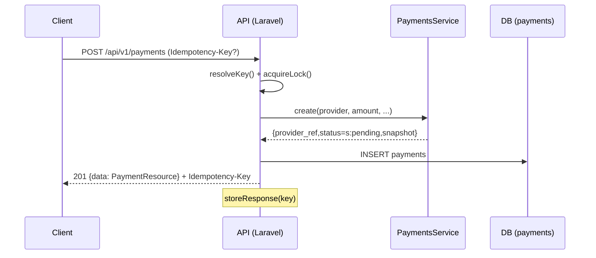
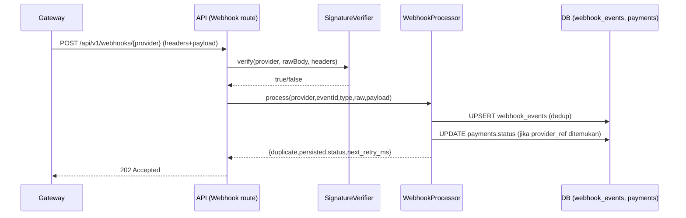

# Arsitektur TenRusl Payment Webhook Simulator

## Ringkasan
Simulator ini mencontohkan arsitektur pembayaran modern: **idempotent create**, **webhook receiver terverifikasi**, **dedup event**, serta **retry dengan backoff + jitter**. Fitur ini memamerkan skill integrasi gateway (Xendit, Midtrans, Stripe, PayPal, Paddle, Lemon Squeezy, Airwallex, Tripay, DOKU, DANA, OY!, Payoneer, Skrill, Amazon BWP) tanpa kredensial asli (mode *simulator*).

## Lapisan & Modul
- **HTTP Layer**
  - **Requests**: validasi (`CreatePaymentRequest`, `WebhookRequest`)
  - **Resources**: bentuk respons (`PaymentResource`, `WebhookEventResource`)
  - **Middleware**:
    - `CorrelationIdMiddleware` — propagasi `X-Correlation-Id`
    - `VerifyWebhookSignature` — rute `/webhooks/{provider}` → `SignatureVerifier`
- **Domain Services**
  - `PaymentsService` — registry adapter (mock/xendit/midtrans/stripe/dst.)
  - `SignatureVerifier` — router verifikasi per provider
  - Idempotency: `IdempotencyKeyService`, `RequestFingerprint`
  - Webhook: `WebhookProcessor` (dedup, infer status, schedule retry)
  - Backoff: `RetryBackoff` (full/equal/decorrelated jitter)
- **Data**
  - Models: `Payment`, `WebhookEvent`, `User`
  - Repositories: `PaymentRepository`, `WebhookEventRepository`
- **Operasional**
  - Console: `tenrusl:webhooks:retry` (scheduler minutely)
  - OpenAPI: anotasi/L5-Swagger & `/docs/openapi.yaml`

## Alur Utama

### 1) Create Payment (Idempotent)

### 2) Webhook Receive (Verified + Dedup + Retry)

## Verifikasi Signature per Provider (ringkas)
- **Xendit**: header `X-CALLBACK-TOKEN`.
- **Midtrans**: `signature_key = SHA512(order_id + status_code + gross_amount + server_key)`.
- **DOKU**: header `Signature` berbasis `Client-Id`, `Request-Id`, `Request-Timestamp`, `Request-Target`, dan `Digest`.
- **Airwallex**: `x-timestamp` + `x-signature` = HMAC-SHA256 atas `timestamp + body`.
- **Tripay**: `X-Callback-Signature` HMAC-SHA256.
- **Lemon Squeezy**: `X-Signature` (HMAC-SHA256 atas raw body).

## Backoff + Jitter
- Mengadopsi pola **exponential backoff dengan jitter** (full/equal/decorrelated).

## Konfigurasi (ENV) — ringkas
- `TENRUSL_MAX_RETRY_ATTEMPTS`, `TENRUSL_IDEMPOTENCY_TTL`
- Secret/verifier per provider (mis. `XENDIT_CALLBACK_TOKEN`, `MIDTRANS_SERVER_KEY`, `STRIPE_WEBHOOK_SECRET`, `DOKU_*`, dll.).

## Testing
- **Pest** untuk unit & feature.
- Uji idempotency: kirim request sama dengan/ tanpa `Idempotency-Key`.
- Uji webhook: kirim payload duplikat (duplicate delivery) dan salah signature (401).

## Observability
- Log correlation id, attempts retry, duplicate event.
- (Opsional) integrasi Sentry/stack logger.
